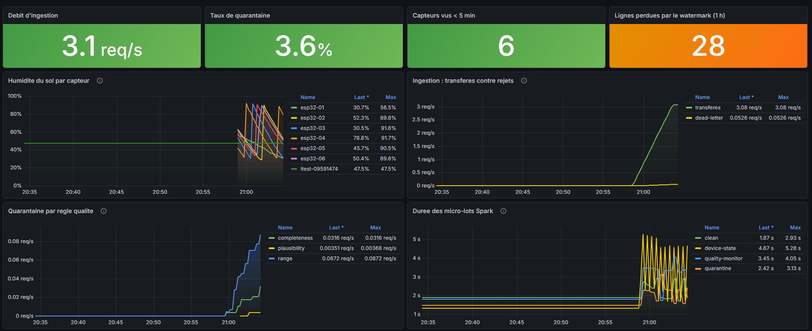

# Smart Irrigation Data Platform


An end-to-end data platform for agricultural IoT telemetry: soil-moisture sensors
publish over MQTT, a bridge forwards to Kafka without losing messages, Spark
Structured Streaming validates and deduplicates, and the result lands in an S3
lakehouse and a serving database. dbt models it, Airflow orchestrates it,
Prometheus and Grafana watch it, and a classifier consumes it downstream.

Everything runs locally with `docker compose up`.

> This is a rebuilt version of my final-year engineering thesis on intelligent
> irrigation. The original work focused on the hardware and the model; this
> version focuses on the **data engineering** — delivery guarantees, data
> quality, reproducibility and operability.



---

## Architecture

```
   ESP32 sensors                      (replaced here by a fault-injecting simulator)
        │  MQTT QoS 1, per-device Last Will
        ▼
  ┌──────────────┐
  │  Mosquitto   │  authenticated, two accounts: esp32 publishes, bridge reads
  └──────┬───────┘
         │
         ▼
  ┌──────────────┐   MQTT is only acknowledged AFTER Kafka confirms the write,
  │ bridge (Py)  │   so a crash costs a duplicate, never a lost message.
  └──────┬───────┘   Structurally invalid payloads go to a dead-letter topic.
         │
         ▼
  ┌──────────────┐   KRaft mode, 3 partitions keyed by device_id
  │    Kafka     │   irrigation.telemetry      (7-day retention)
  └──────┬───────┘   irrigation.telemetry.dlq  (30-day retention)
         │
         ▼
  ┌─────────────────────────────────────────────┐
  │      Spark Structured Streaming              │
  │  explicit schema -> 3 quality gates          │
  │  -> watermark 10 min -> dedup (device_id,ts) │
  └───────┬─────────────────────────┬────────────┘
          │                         │
          ▼                         ▼
  ┌───────────────┐         ┌───────────────┐
  │ MinIO (S3)    │         │   MongoDB     │
  │ Parquet       │         │ one doc per   │
  │ telemetry/    │         │ device, order │
  │  site_id/date │         │ safe upsert   │
  │ quarantine/   │         └───────┬───────┘
  │  rule/date    │                 │
  └───────┬───────┘                 │
          │                         │
          ▼                         ▼
  ┌───────────────┐         ┌───────────────────────┐
  │ DuckDB + dbt  │         │ Airflow  freshness    │
  │ stg_telemetry │         │ Prometheus + Grafana  │
  │  ├ fct_hourly │         └───────────────────────┘
  │  └ dim_devices│
  └───────┬───────┘
          ▼
  scikit-learn classifier, versioned in MinIO,
  promoted only when it beats the model in production
```

---

## What this project actually demonstrates

The interesting parts are not the tools, they are the decisions.

**No message is lost between MQTT and Kafka.** The MQTT client runs with manual
acknowledgement: the `PUBACK` is sent from the Kafka delivery callback, not on
reception. A crash in between therefore costs a duplicate, not a loss —
and duplicates are removed downstream. *Measured: bridge killed for 30 s under
load, Kafka offsets went 660 → 756, zero messages lost.*

**Rejected data is kept, with a reason.** Records failing a quality gate are
written to a quarantine sink carrying a structured reason
(`range:soil_moisture_pct`) and the original payload. Nothing goes to
`/dev/null`.

**Silent losses are instrumented.** A watermark discards late-arriving rows
without any error. A `StreamingQueryListener` exposes
`irrigation_spark_rows_dropped_by_watermark_total` so the loss is visible on a
dashboard instead of being invisible by design.

**Quality rules are deterministic.** Plausibility is evaluated against the
broker's ingestion timestamp, never against the wall clock. Replaying the same
data next month produces exactly the same verdicts — which is what makes the
pipeline replayable at all.

**Idempotence lives where it is cheapest.** The MongoDB serving layer uses a
conditional upsert that only applies when the stored timestamp is older, so
replaying a batch is a no-op. That removes a stateful operator from Spark
entirely.

**Retraining can refuse to promote.** The nightly job trains a candidate and
compares it — against a rule-based baseline first, then against the model
currently in production. If it does not improve, nothing is promoted and the
DAG still succeeds. Refusing is a normal outcome, not an incident.

**Everything bootstraps itself.** Kafka topics, the MinIO bucket, Mosquitto
credentials, Grafana datasources and dashboards are all created from files in
this repository. `docker compose down -v && docker compose up -d` rebuilds a
working system with no manual clicking.

---

## Quick start

**Requirements:** Docker Desktop, Git, Python 3.11+. The stack binds ports 1883,
3000, 4040, 8000–8082, 9000, 9001, 9090 and 27017 — stop anything already using
them, including another copy of this project.

### 1. Clone

```bash
git clone https://github.com/hamzalj85/smart-irrigation-platform.git
cd smart-irrigation-platform
cp .env.example .env
```

### 2. Fill in the secrets — not optional

`.env` ships with `changeme` placeholders. **Nothing will start until they are
replaced**: the bootstrap scripts refuse placeholder values on purpose.

Generate one password per entry:

```powershell
# Windows: run once per secret, paste the result into .env
-join ((48..57)+(65..90)+(97..122) | Get-Random -Count 24 | % {[char]$_})
```

```bash
# macOS / Linux
openssl rand -base64 18
```

Six values to replace: `MOSQUITTO_ESP32_PASSWORD`, `MOSQUITTO_BRIDGE_PASSWORD`,
`MINIO_ROOT_PASSWORD`, `MONGO_INITDB_ROOT_PASSWORD`, `AIRFLOW_DB_PASSWORD`,
`AIRFLOW_JWT_SECRET`, plus `GRAFANA_ADMIN_PASSWORD`.

### 3. Generate the Mosquitto password file

Mosquitto stores hashed passwords in a file that is git-ignored. This script
builds it from `.env`, which stays the single source of truth:

```powershell
.\scripts\init-mosquitto-passwd.ps1
```

### 4. Start

```bash
docker compose up -d
docker compose logs -f spark-streaming   # wait for 4 "[listener] query started"
```

First run pulls and builds around 4 GB of images — allow ten minutes.

### 5. Feed it data

The pipeline runs in Docker, but the sensor simulator runs on your machine — it
stands in for devices that would be out in a field. It needs its own Python
environment:

```powershell
python -m venv .venv
.venv\Scripts\Activate.ps1
pip install -r ingestion\simulator\requirements.txt

. .\scripts\load-env.ps1     # loads .env into the session (note the leading dot)
python ingestion\simulator\simulator.py --sensors 6 --interval 2s --fault-rate 0.15 --speed 120
```

```bash
# macOS / Linux
python -m venv .venv && source .venv/bin/activate
pip install -r ingestion/simulator/requirements.txt
set -a && source .env && set +a
python ingestion/simulator/simulator.py --sensors 6 --interval 2s --fault-rate 0.15 --speed 120
```

| Flag | Effect |
| --- | --- |
| `--sensors N` | number of simulated devices, each with its own drift |
| `--fault-rate` | fraction of readings made faulty on purpose |
| `--offline-rate` | chance a device goes silent for a few cycles |
| `--speed` | accelerates the soil model so a full irrigation cycle takes minutes instead of hours |
| `--seed` | fixes the randomness, for reproducible runs |

Leave it running for two or three minutes, then open Grafana.

For the analysis tools (`scripts/inspect_data.py`, dbt, the model) install the
wider set instead:

```bash
pip install -r requirements-dev.txt
```

### 6. Look at it

| Service | URL | Notes |
| --- | --- | --- |
| Grafana | http://localhost:3000 | anonymous read access |
| Prometheus | http://localhost:9090 | |
| Airflow | http://localhost:8082 | auth disabled (dev only) |
| Kafka UI | http://localhost:8080 | |
| MinIO console | http://localhost:9001 | |
| Mongo Express | http://localhost:8081 | |
| Spark UI | http://localhost:4040 | |

Inspect what the pipeline produced:

```powershell
python scripts\inspect_data.py
```

---

## The data contract

The firmware and the simulator emit the same JSON on the same topics
(`irrigation/<site_id>/<device_id>/telemetry`):

```json
{
  "device_id": "esp32-01",
  "site_id": "site-a",
  "ts": "2026-08-10T22:06:30.066Z",
  "soil_moisture_pct": 54.89,
  "soil_raw": 2102,
  "air_temp_c": 24.3,
  "air_humidity_pct": 55.1,
  "battery_v": 3.92,
  "fw_version": "1.0.0"
}
```

Two deliberate choices:

- **`ts` is produced by the sensor**, not by the broker. It is the event time.
  A device that reconnects after three hours offline must not corrupt hourly
  aggregates, which is what the watermark protects against.
- **`soil_raw` is kept next to `soil_moisture_pct`.** The raw ADC reading is the
  only thing actually measured; the percentage is the output of a calibration
  that can drift or be wrong. Keeping the source allows recalibrating later.

---

## Data quality

Three gates, evaluated in order — the first failure wins:

| Gate | Checks | Example reason |
| --- | --- | --- |
| Completeness | mandatory fields present and non-null | `completeness:soil_moisture_pct` |
| Range | physical hardware limits | `range:soil_raw` (12-bit ADC, 0–4095) |
| Plausibility | event time coherent with ingestion time | `plausibility:stale_ts` |

Thresholds come from the hardware, not from round numbers: the DHT22 range for
air temperature, the ESP32 ADC width for the raw reading, LiPo limits for the
battery.

Validation is split by responsibility. The **bridge** judges *structure*
(readable JSON, mandatory fields) and can reject before Kafka. **Spark** judges
*meaning* (bounds, temporal coherence). A moisture reading of 148 % is
structurally valid and passes the bridge on purpose.

### Measured behaviour

Four minutes, six simulated devices, 20 % injected fault rate:

```
878 messages produced
    805  valid       -> Parquet in MinIO, partitioned site_id/date
     73  quarantined -> range 44, completeness 22, plausibility 7
     22  dead-letter -> invalid structure, stopped by the bridge
      0  out-of-range values in the clean sink
      0  duplicate (device_id, ts) keys
      6  device-state documents in MongoDB
```

---

## Orchestration

Three Airflow DAGs:

| DAG | Schedule | What it does |
| --- | --- | --- |
| `daily_aggregation` | 02:00 | runs `dbt build`, then **validates** the marts: non-empty, no empty hourly bucket, data younger than 26 h |
| `freshness_check` | every 15 min | cross-checks MongoDB against the retained MQTT status topic |
| `model_retrain` | 03:00 | trains a candidate, promotes it only if it improves |

`freshness_check` is the one worth explaining. Comparing two independent sources
turns "six devices are silent" into an actionable classification:

- silent **and** the broker says `offline` → known outage (the device announced
  it, or its Last Will fired). Logged.
- silent **and** the broker says `online` → the connection is alive but no data
  flows: firmware hang, dead sensor, stalled bridge. **This fails the run.**
- silent **and** no retained status → never connected, or broker state lost.

A single source cannot make that distinction.

---

## Transformations

dbt on DuckDB, reading the Parquet files directly from MinIO — no copy, no load.

```
lake.telemetry ──► stg_telemetry ──┬──► fct_readings_hourly
                                   └──► dim_devices
```

17 nodes: 1 view, 2 tables, 14 schema tests (`not_null`, `unique`, and a custom
`accepted_range` generic test written in ten lines rather than pulling in a
package).

The `unique` test on `dim_devices.device_id` is the important one: it guards the
**grain** of the table. The day a bad join duplicates rows, the test fails before
anyone reads a wrong report.

`fct_readings_hourly` keeps min, max *and* average moisture. An hourly average
hides exactly the signal that matters — irrigation lifts the soil from 30 % to
90 % in minutes, and the average would report 55 %, a value that never occurred.

---

## The model, repositioned

The classifier is a **downstream consumer** of the platform, not its centrepiece.
It reads `fct_readings_hourly`, the same table an analyst would query.

Task: will the *minimum* soil moisture of the next hour drop below 32 %?

```
6 462 device-hours, 6 devices, 10.3 % positive class
train: 1 Jul → 1 Aug      test: 1 Aug → 15 Aug      (chronological split)

  rule baseline        f1 = 0.503   (accuracy 0.877 — misleading)
  logistic regression  f1 = 0.814   auc = 0.966
  random forest        f1 = 0.892   auc = 0.975   <- selected
```

Three things this reports that the original thesis did not:

**The split is chronological, never random.** Soil moisture is strongly
autocorrelated; a random split puts hour *t* in training and hour *t+1* in test,
so the model "predicts" what it has almost already seen and the score is
meaningless.

**There is a baseline to beat.** A four-line business rule — *"if the soil is
already near the threshold it will cross it"* — scores 0.503. Any model that
does not clearly beat it deserves to be replaced by SQL.

**Accuracy is reported as the trap it is.** The baseline reaches 87.7 % accuracy
while missing 40 % of the irrigation needs. With a 10 % positive class, a model
that always answers "no" would score 90 %. Promotion is decided on F1.

Every run writes a versioned artefact and a `metrics.json` to MinIO, recording
dataset size, class balance in both splits, exact periods, split method and git
revision.

---

## Monitoring

Prometheus scrapes the bridge and the Spark driver every 15 seconds. Pull, not
push: a dead service becomes a visible `DOWN` target instead of quietly
disappearing from a chart.

The Grafana dashboard is **provisioned from this repository** — datasource,
folder and panels are files, not rows in Grafana's internal database.
`allow_ui_updates` is disabled so the UI cannot overwrite them.

Panels: ingestion throughput, quarantine rate by rule, live soil moisture per
device, micro-batch duration, device fleet table with silence age, and rows
dropped by the watermark.

---

## Tests

```bash
pip install -r requirements-dev.txt
pytest -m "not integration and not spark"    # 58 tests, ~2 s
```

The Spark tests need Java 17 (Spark 3.5 does not support newer JVMs), so they
run inside the streaming image — same JVM, same PySpark, same Python as
production:

```powershell
.\scripts\test-spark.ps1                     # 13 tests
```

The integration test walks the whole chain — publish on MQTT, assert the record
lands in Parquet. It needs the stack running and is excluded from CI:

```bash
docker compose up -d
pytest -m integration
```

CI runs four jobs on every push: ruff, the 71 unit tests, `dbt parse`, and
`docker compose config` — the last one catches broken YAML anchors and missing
environment variables before they break someone else's clone.

The test worth reading is `test_aucune_fuite_du_futur` in `tests/test_features.py`.
It builds two datasets identical except for the final hour and asserts that no
feature of the preceding hours changed. Data leakage raises no error: it just
produces a flattering score and a useless model.

---

## Repository layout

```
firmware/esp32/      sensor firmware (see docs/hardware.md)
ingestion/simulator/ fault-injecting sensor simulator
ingestion/bridge/    MQTT -> Kafka bridge, dead-letter queue
streaming/spark/     Structured Streaming job, quality gates
transforms/dbt/      staging and marts, schema tests
orchestration/       Airflow DAGs
ml/                  features, training, history backfill
monitoring/          Prometheus config, Grafana dashboards as code
tests/               unit and integration tests
scripts/             bootstrap and inspection helpers
docs/                architecture and hardware notes
```

The layout mirrors the pipeline: anyone opening the repository can follow the
data before reading a line of code.

---

## Honest limitations

- **The data is simulated.** The simulator replays a deterministic soil model, so
  an F1 of 0.89 measures how well the model learns that simulation — not field
  performance. On real sensors, with noise, drift, rain and shade, scores would
  be markedly lower. What transfers is the protocol: chronological split,
  business baseline, complete metrics, conditional promotion.
- **`ml/generate_history.py` is a development shortcut.** It writes 45 days of
  synthetic history straight to the lake so the model has something to learn
  from. The streaming path is the production one.
- **Single-node everything.** One Kafka broker, `local[2]` Spark, LocalExecutor
  Airflow. The architecture scales out; this deployment does not pretend to.
- **Authentication is disabled on Airflow and Grafana** for local convenience.
  Both would need a real identity provider outside a laptop.
- **The firmware is not published.** The hardware setup and calibration
  procedure are documented in `docs/hardware.md`, but the ESP32 sketch is not
  part of this repository.

---

## Origin and credits

This platform rebuilds the data pipeline of a final-year engineering thesis on
intelligent irrigation, carried out jointly with **Siham Chtaioui**. The
original work covered the hardware, the field deployment and the first models;
this repository is a rewrite of the data layer and is published with her
agreement. The thesis itself is not included here.

## License

MIT — see [LICENSE](LICENSE).
